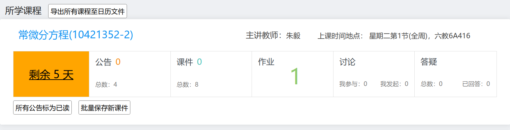

# learn2018helper

网络学堂2018助手

可以在 [网络学堂1202助手 - Greasy Fork](https://greasyfork.org/en/scripts/422447-%E7%BD%91%E7%BB%9C%E5%AD%A6%E5%A0%821202%E5%8A%A9%E6%89%8B) 这里配合 TamperMonkey 等脚本管理器使用。

项目地址：[https://github.com/yesh0/thu-learn-helper](https://github.com/yesh0/thu-learn-helper)

原项目 [https://github.com/Exhen/learn2018helper](https://github.com/Exhen/learn2018helper)。

现在代码完全重写了，代码许可证是 [AGPL](./LICENSE)。

可以到科技服务队的微信推送里查看功能： [https://mp.weixin.qq.com/s/DflkCO-pMiiFrsMQEFyLTA](https://mp.weixin.qq.com/s/DflkCO-pMiiFrsMQEFyLTA)

截图：

## 更新日志

2023.09.17. 适配新学期界面（指自动切换回旧界面）；修复学期交界适配

2023.09.14. 哇网络学堂好像好看点了耶，重新适配新界面；删去了无用的、我已理解不了的一些功能；适配研究生日程下载

2022.09.12. 修复导出所有课程日历功能。

2022.03.06. 暂时修复周数显示，网络学堂不再支持课件文件名抓取。

2021.11.18. 修复：不再抓取新课件的文件名，否则网络学堂会将新课件标为已下载。

2021.11.02. 添加简单周数显示。

2021.11.01. ddl 提醒添加具体时间，修正网络学堂鼠标指针。

2021.10.30. 网络学堂课程文件列表添加显示文件名功能。

2021.10.29. 修复导出课程日历提醒时间错误。

2021.10.28. 把左上角图标链接改为指向“我的课程”列表，而不是登录界面。

2021.10.21. 所有代码重写，顺便增加一并导出所有课程日历功能。

2021.10.17. 删去了未授权代码，切换“以前学期课程”再切回时自动刷新。

2021.10.16. 完善公告标记已读功能（测试了但没完全测试）。

2021.10.14. 再次修复无法显示作业 ddl 的 bug。

2021.09.20. 网络学堂增加了 CSRF 验证，无法查看作业 ddl，已修复；删去了原作者的扫码催更。

忘了什么时候：删去了悲伤蛙，改为用亮绿、橙黄、亮红等颜色来标识 ddl 远近。
