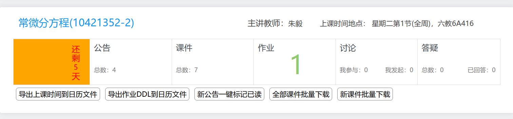

# learn2018helper
网络学堂2018助手

可以在 [网络学堂1202助手 - Greasy Fork](https://greasyfork.org/en/scripts/422447-%E7%BD%91%E7%BB%9C%E5%AD%A6%E5%A0%821202%E5%8A%A9%E6%89%8B) 这里配合 TamperMonkey 等脚本管理器使用。

项目地址：[https://git.tsinghua.edu.cn/yesh19/learn2018helper](https://git.tsinghua.edu.cn/yesh19/learn2018helper) （清华 GitLab 似乎访客看不见。）

项目来自 [https://github.com/Exhen/learn2018helper](https://github.com/Exhen/learn2018helper)。这里把悲伤蛙的图片去掉了，改为了更鲜明的颜色。

可以到科技服务队的微信推送里查看功能： [https://mp.weixin.qq.com/s/DflkCO-pMiiFrsMQEFyLTA](https://mp.weixin.qq.com/s/DflkCO-pMiiFrsMQEFyLTA)

截图：

## 更新日志

2021.10.16. 完善公告标记已读功能（测试了但没完全测试）。

2021.10.14. 再次修复无法显示作业 ddl 的 bug。

2021.09.20. 网络学堂增加了 CSRF 验证，无法查看作业 ddl，已修复；删去了原作者的扫码催更。

忘了什么时候：删去了悲伤蛙，改为用亮绿、橙黄、亮红等颜色来标识 ddl 远近。
